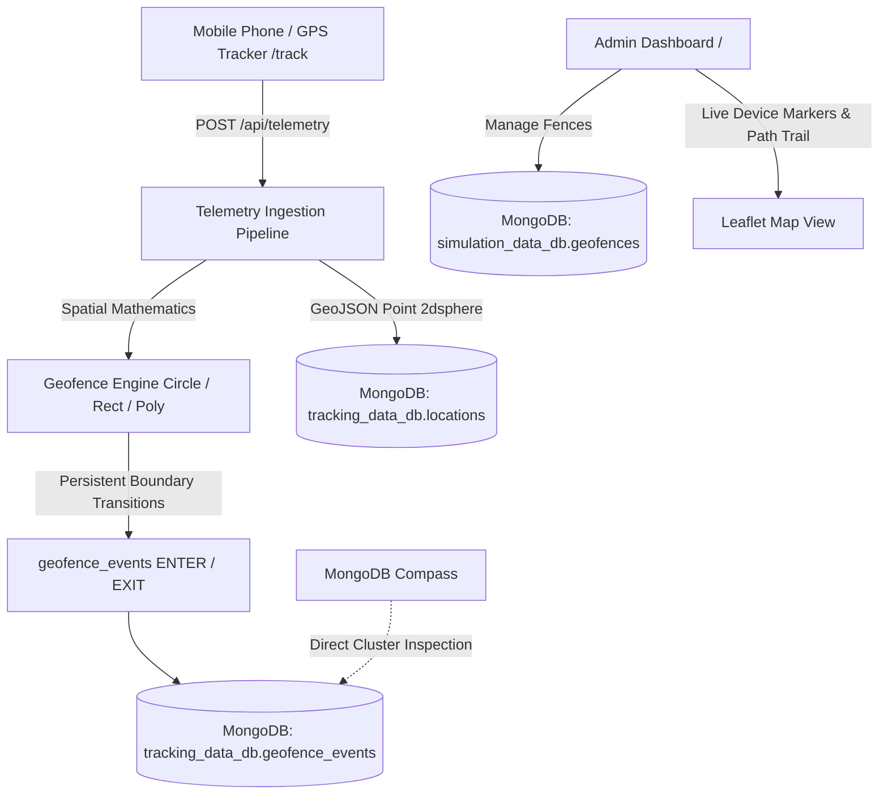
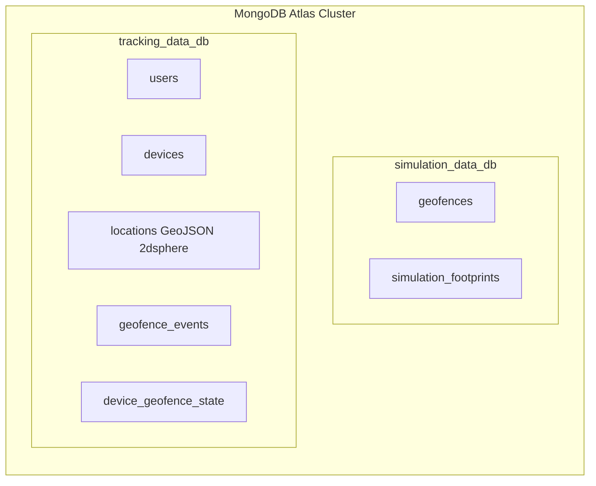

# Virtual Fence & Asset Tracking — User Manual

A comprehensive operational manual and technical guide for configuring, managing, and running real-time geofences, interactive boundary breach detection, live multi-asset simulations, and telemetry persistence with MongoDB.

---

## Table of Contents
1. [System Overview & Architecture](#1-system-overview--architecture)
2. [Prerequisites & Environment Setup](#2-prerequisites--environment-setup)
3. [User Interface Overview](#3-user-interface-overview)
4. [Creating & Editing Geofences](#4-creating--editing-geofences)
   - [Circular Geofences](#circular-geofences)
   - [Rectangular Geofences](#rectangular-geofences)
   - [Custom Polygon Geofences](#custom-polygon-geofences)
   - [Metadata, Colors & Status](#metadata-colors--status)
5. [Real-Time Mouse Tracking & Boundary Flags](#5-real-time-mouse-tracking--boundary-flags)
6. [Live Multi-Asset Simulation Engine](#6-live-multi-asset-simulation-engine)
   - [Assets & Kinetic Modeling](#assets--kinetic-modeling)
   - [Lifecycle: Entry, Interior Cruising, Exit & Re-Entry](#lifecycle-entry-interior-cruising-exit--re-entry)
6. [Real GPS Multi-Device Ingestion & Mobile Tracker](#6-real-gps-multi-device-ingestion--mobile-tracker)
   - [Mobile Phone GPS Client (`/track`)](#mobile-phone-gps-client-track)
   - [Multi-Device Fleet Monitoring](#multi-device-fleet-monitoring)
   - [Persistent Boundary Breach Engine](#persistent-boundary-breach-engine)
7. [Flag & Footprint Display Controls](#7-flag--footprint-display-controls)
8. [MongoDB Atlas & Compass Database Guide](#8-mongodb-atlas--compass-database-guide)
   - [Database Roles: Geofences DB vs Tracking DB](#database-roles-geofences-db-vs-tracking-db)
   - [Document Schemas](#document-schemas)
   - [Inspecting Data in MongoDB Compass](#inspecting-data-in-mongodb-compass)
9. [Data Management & GeoJSON Integration](#9-data-management--geojson-integration)
10. [Troubleshooting & FAQ](#10-troubleshooting--faq)
11. [Deploying to Vercel (1-Click Guide)](#11-deploying-to-vercel-1-click-guide)

---

## 1. System Overview & Architecture

Virtual Fence Map Builder is a high-performance web GIS and perimeter security application. It enables operators to draw virtual boundaries over multi-style base maps (Google Satellite, Hybrid, Streets, OpenStreetMap, Esri) and track real GPS devices and smartphones with persistent boundary breach detection in real time.



### Core Technologies
- **Frontend**: Leaflet.js, HTML5 Geolocation API, Vanilla JavaScript, CSS3 with responsive glassmorphism aesthetic.
- **Containment Calculations**: Haversine Spherical Distance formula (Circles), Bounding Box intersection (Rectangles), Jordan Curve Ray-Casting algorithm (Polygons).
- **Backend**: Python 3 (Flask or Python standard HTTP engine).
- **Database**: MongoDB Atlas Cluster split across `simulation_data_db` (geofences) and `tracking_data_db` (devices, locations, events).

---

## 2. Prerequisites & Environment Setup

### System Requirements
- Python 3.8 or higher installed on your system.
- An internet connection for map tile loading and MongoDB Atlas cloud synchronization.
- A free or paid MongoDB Atlas cluster (or local MongoDB Community Edition).

### Step 1: Install Python Dependencies
Open your terminal in the project directory and run:
```bash
pip install -r requirements.txt
```

### Step 2: Configure MongoDB Connection
Create a `.env` file in the project root directory (refer to `.env.example`):
```env
# MongoDB Atlas Connection URI
MONGODB_URI=mongodb+srv://<username>:<password>@<cluster-url>.mongodb.net/?retryWrites=true&w=majority

# Primary Databases
MONGODB_SIMULATION_DB=simulation_data_db
MONGODB_TRACKING_DB=tracking_data_db

# Web Server Port
PORT=5000
```

> [!CAUTION]
> Never commit your real `.env` file to version control. The `.gitignore` file is pre-configured to keep your credentials strictly local and private.

### Step 3: Start the Backend Server
Launch the server via PowerShell, Command Prompt, or Bash:
```bash
python server.py
```

The terminal will confirm the connection to MongoDB Atlas:
```
================================================================
>> GEOFENCE MAP BUILDER - PYTHON BACKEND
>> Exclusive Database Engine: MongoDB Atlas & Compass
>> 1. Geofences DB: 'simulation_data_db' (geofences, simulation_footprints)
>> 2. Tracking DB:  'tracking_data_db' (devices, locations, geofence_events)
>> Serving Dashboard at: http://localhost:5000
================================================================
```

### Step 4: Open the Dashboard
- Admin Dashboard: `http://localhost:5000`
- Mobile Tracker: `http://localhost:5000/track`

---

## 3. User Interface Overview

```
+-----------------------------------------------------------------------------------------+
| [Search Location]                [MongoDB Compass Status] [Basemap Select] [Fit All]    |
+----------------------+------------------------------------------------------------------+
| [+ Add Geofence]     | [HUD: Cursor Lat/Lng | Mouse Fence | Flag Count | Center | Zoom] |
|                      |                                                                  |
| Shape Selector:      |                                                                  |
| (Circle / Rect / Poly)|                                                                  |
|                      |                                                                  |
| Geometry Inputs      |                               MAP CANVAS                         |
| (Radius / Bounds)    |                                                                  |
|                      |                      (Leaflet Interactive GIS)                   |
| Metadata & Color     |                                                                  |
| [Save Geofence]      |                                                                  |
|                      |                                                                  |
| Saved Fences List    |                                                                  |
|                      |                                                                  |
| Footprints & Sim:    |                                                                  |
| [▶ Start Simulation] |                                                                  |
| [👣 Drop 5 in Area]  |                                                                  |
| Event Log Stream     +------------------------------------------------------------------+
|                      | GEOFENCE DETAILS DOCK (Coordinates, Area, Perimeter, Copy, Edit) |
+----------------------+------------------------------------------------------------------+
```

1. **Top Header Bar**:
   - **Search Location**: Nominatim OpenStreetMap geocoding box. Type any city, facility, or landmark and press Enter to fly to that coordinate.
   - **Database Status Badge**: Displays real-time connectivity status with MongoDB Atlas.
   - **Basemap Switcher**: Instantly switch between 8 GIS layer styles:
     - Google Maps (Standard Streets, Satellite & Labels Hybrid, Terrain)
     - OpenStreetMap (Standard, Humanitarian)
     - Esri World (Street Map, World Satellite)
     - OpenTopoMap
   - **Fit All**: Adjusts map bounds so all saved geofences are visible in the viewport.
   - **Locate Me**: Jump immediately to your device's browser GPS coordinate.

2. **Left Control Sidebar**:
   - **Mode Selector**: Choose between Add Geofence and Explore Mode.
   - **Geofence Form**: Configure coordinates, radii, bounding boxes, polygon vertices, color, and name.
   - **Saved Geofences List**: Filter, select, edit, zoom to, or delete fences.
   - **GeoJSON Tools**: One-click export and import of GeoJSON files.
   - **Simulation & Switches**: Toggle mouse tracking, footprints, and visual flags; start/pause multi-asset simulation.
   - **Real-Time Event Stream**: Live chronological feed of `ENTER`, `INSIDE`, and `EXIT` events.

3. **Center Map Viewport**:
   - High-resolution interactive GIS canvas with draggable boundary nodes, animated radar flag markers, continuous asset avatars, and breadcrumbs.
   - **Floating HUD Bar**: Real-time cursor coordinates, active mouse fence status, total flags generated, map center, and zoom level.

4. **Bottom Details Dock**:
   - Displays exact mathematical calculations (Area in $m^2$/hectares, Perimeter in meters, exact coordinates) for the selected fence.
   - Quick **Copy Data** button to paste geofence coordinates into external tools.

---

## 4. Creating & Editing Geofences

### Circular Geofences
1. Click **+ Add Geofence** at the top of the sidebar.
2. Select the **Circle** mode tab.
3. Click anywhere on the map to place the center point.
4. Adjust the radius using any of the three synchronized methods:
   - **Map Drag**: Click and drag the white radius handle on the map perimeter.
   - **Radius Input / Slider**: Drag the slider from 20m to 2500m or enter an exact number in meters.
   - **Preset Buttons**: Click **50m**, **100m**, **200m**, **500m**, **1 km**, or **2 km**.

### Rectangular Geofences
1. Select the **Rectangle** mode tab.
2. Click and drag across any area on the map to define the bounding box.
3. Or manually enter the North, South, East, and West decimal coordinates into the bounding inputs.

### Custom Polygon Geofences
1. Select the **Polygon** mode tab.
2. Click consecutive points on the map to outline the perimeter (a dynamic line connects the vertices).
3. The vertex counter displays the total number of points added.
4. Click **✓ Finish Polygon** to close the boundary loop.
5. If you make a mistake, click **Clear Points** to start over.

### Metadata, Colors & Status
- **Geofence Name**: Enter an identifier (e.g. `Song River Sector Alpha`, `HQ Security Zone`). If left blank, an incremental name (e.g. `Geofence 1`, `Geofence 2`) is automatically assigned.
- **Description / Notes**: Optional field for security protocols or operational notes.
- **Zone Color**: Pick from 5 curated colors (Blue `#2563eb`, Green `#10b981`, Purple `#8b5cf6`, Amber `#f59e0b`, Red `#ef4444`). The perimeter line, fill tint, and telemetry flags will match this color.
- **Initial Status**: Toggle **Active** (monitored for breaches) or **Disabled** (ignored by tracking engines).
- Click **Save Geofence**. The geofence is immediately saved locally and synchronized with MongoDB `simulation_data_db.geofences`.

---

## 5. Real-Time Mouse Tracking & Boundary Flags

The system features real-time cursor boundary analysis that turns your mouse pointer into a virtual tracking asset.

### How It Works
1. As you move the mouse across the map canvas, the application checks whether the cursor coordinates reside inside any active geofence using:
   - Haversine distance for circles ($d \le R$).
   - Latitude/longitude span checks for rectangles.
   - Ray-casting point-in-polygon algorithm for complex polygons.
2. When the cursor crosses a fence perimeter:
   - **Entering Fence**: Triggers an `ENTER` transition.
     - A green radar flag marker (`🚩 ENTER: Mouse - <FenceName>`) is planted at the exact perimeter crossing coordinate.
     - A green toast alert appears: `🚩 Flag Generated: Mouse ENTERED "<FenceName>"`.
     - The floating HUD chip updates to `🟢 Inside "<FenceName>"`.
     - The event is logged in the sidebar stream and saved to MongoDB.
   - **Exiting Fence**: Triggers an `EXIT` transition.
     - A red radar flag marker (`🚩 EXIT: Mouse - <FenceName>`) is planted at the exit coordinate.
     - A warning toast alert appears: `🚩 Flag Generated: Mouse EXITED "<FenceName>"`.
     - The HUD updates to `Outside Fences`.

---

## 6. Real GPS Multi-Device Ingestion & Mobile Tracker

The platform runs on real GPS telemetry from mobile phones and external tracking devices.

### Mobile Phone GPS Client (`/track`)
- Navigate to `http://localhost:5000/track` on any mobile phone or browser.
- Uses HTML5 Geolocation `navigator.geolocation.watchPosition` with `enableHighAccuracy: true`.
- Keeps the screen awake using the Screen Wake Lock API (`navigator.wakeLock.request('screen')`).
- Automatically buffers locations in `localStorage` when offline and flushes when reconnected.

### Multi-Device Fleet Monitoring
- Real-time device registry tracks status (`online`, `inactive`, `offline`), platform, accuracy, battery, and last seen.
- Admin dashboard polls `/api/devices` every 4 seconds, rendering live pulsed markers with heading arrows on the Leaflet canvas.
- Click any device in the sidebar to inspect its details and view its full historical movement path trail on the map.

### Persistent Boundary Breach Engine
- Ingested coordinates are mathematically evaluated against all active circle, rectangle, and polygon geofences.
- Boundary states are persisted in the `device_geofence_state` collection.
- `ENTER` and `EXIT` events are recorded ONLY when a real device crosses a physical boundary perimeter, avoiding duplicate false triggers.

---

## 7. Flag & Footprint Display Controls

Located under the **Live Breach Events** section in the sidebar:

| Control Toggle | When ON (Checked) | When OFF (Unchecked) |
|---|---|---|
| **Show Footprints** | Displays breadcrumb trail dots on the map canvas. | Hides breadcrumbs from map (events still logged). |
| **Show Flags** | Renders visual radar pins (`🚩 ENTER` / `🚩 EXIT`) on the map canvas. | Suppresses map flag pins for a clean map view, while still providing toast messages, HUD counter increments, and database logging. |

---

## 8. MongoDB Atlas & Compass Database Guide

### Database Roles: Geofences DB vs Tracking DB

The system cleanly organizes data into two specialized databases in your MongoDB Atlas cluster:



1. **`simulation_data_db`**:
   - **`geofences`**: Stores all saved boundary perimeters, coordinates, radii, and statuses.
   - **`simulation_footprints`**: Contains real-time breach event logs mirroring GPS transitions.
2. **`tracking_data_db`**:
   - **`devices`**: Device registry, connection status, platform, and last-seen metadata.
   - **`locations`**: GeoJSON 2dsphere spatial points recording full device movement histories.
   - **`geofence_events`**: Immutable audit logs of every boundary enter/exit event.
   - **`device_geofence_state`**: State tracker ensuring transitions fire only on true boundary crossing.

### Document Schemas

#### Real Location Record (`tracking_data_db.locations`):
```json
{
  "location_id": "loc_1790610005000_d4e5f6",
  "device_id": "phone_pixel_7a",
  "location": {
    "type": "Point",
    "coordinates": [78.123456, 30.124500]
  },
  "latitude": 30.124500,
  "longitude": 78.123456,
  "accuracy": 8.4,
  "heading": 142.0,
  "speed": 1.4,
  "battery": 87,
  "timestamp": "2026-10-01T12:00:03.000Z"
}
```

#### Boundary Event Record (`tracking_data_db.geofence_events`):
```json
{
  "event_id": "evt_1790610005000_a1b2c3",
  "device_id": "phone_pixel_7a",
  "device_name": "Nitin's Pixel",
  "geofence_id": "geo_1790610000000_a1b2c3",
  "geofence_name": "Main Perimeter",
  "event_type": "ENTER",
  "latitude": 30.124500,
  "longitude": 78.123456,
  "timestamp": "2026-10-01T12:00:03.000Z"
}
```

### Inspecting Data in MongoDB Compass

1. Open **MongoDB Compass** on your desktop.
2. Paste your connection string from `.env`:
   ```
   mongodb+srv://<username>:<password>@<cluster-url>.mongodb.net/?retryWrites=true&w=majority
   ```
3. Click **Connect**.
4. Explore your collections:
   - Click **`simulation_data_db` &rarr; `geofences`** to view active geofences.
   - Click **`tracking_data_db` &rarr; `devices`** to inspect registered hardware.
   - Click **`tracking_data_db` &rarr; `locations`** to view GeoJSON spatial data.
   - Click **`tracking_data_db` &rarr; `geofence_events`** to view perimeter breaches.

---

## 9. Data Management & GeoJSON Integration

### Exporting Geofences to GeoJSON
1. In the sidebar under **Saved Geofences**, click **Export GeoJSON**.
2. A `.geojson` file (formatted as an RFC 7946 `FeatureCollection`) will automatically download to your browser.
3. This file can be imported into QGIS, ArcGIS, Google Earth, or any GIS application.

### Importing Geofences from GeoJSON
1. Click **Import GeoJSON**.
2. Select any standard `.geojson` or `.json` file containing `Polygon`, `Point` (with radius property), or `MultiPolygon` geometries.
3. The dashboard parses the coordinates, verifies topology, renders the shapes on the map, and stores them in MongoDB.

---

## 10. Troubleshooting & FAQ

### Q: Why are flag markers not appearing on the map canvas?
- Check the **Show Flags** switch in the sidebar. If this switch is toggled **OFF**, visual flag radar pins on the map canvas are intentionally hidden to keep the map clean, but toast alerts and database telemetry logging continue to function. Toggle **Show Flags** to **ON** to see map pins.

### Q: How do I track a real smartphone?
- Open `http://<server-ip>:5000/track` on the phone's browser.
- Enter a device name and tap **Start Tracking**. Allow location access when prompted.
- The phone will automatically register with the backend and begin streaming high-accuracy GPS coordinates.

### Q: How do I clear all historical footprints and flag markers?
- In the sidebar under **Live Breach Events**, click the **✕** button to clear the event logs and markers.

### Q: The map shows "Offline / In-Memory Mode" instead of MongoDB.
- Verify that your MongoDB Atlas cluster IP access list allows connections from your current IP address (in the Atlas web console, go to **Network Access &rarr; Add IP Address &rarr; Allow Access from Anywhere `0.0.0.0/0`** for testing).
- Ensure your `.env` contains the correct connection string.

---

## 11. Deploying to Vercel (1-Click Guide)

This application is fully pre-configured for instant deployment on [Vercel](https://vercel.com) using Vercel's Python Serverless Runtime + Edge Static Delivery.

### Step 1: Allow Vercel Dynamic IPs in MongoDB Atlas
Because Vercel Serverless Functions execute on dynamic IP addresses, you must allow Atlas network traffic from anywhere:
1. Log in to [cloud.mongodb.com](https://cloud.mongodb.com).
2. In the left navigation, click **Network Access** (under Security).
3. Click **+ Add IP Address**.
4. Click **Allow Access from Anywhere** (`0.0.0.0/0`).
5. Click **Confirm**.

### Step 2: Push Your Code to GitHub
Ensure all code and configuration files (`api/index.py`, `vercel.json`, `requirements.txt`) are committed and pushed to your GitHub repository.

### Step 3: Import Project into Vercel
1. Go to [vercel.com](https://vercel.com) and log in with your GitHub account.
2. From the Vercel dashboard, click **Add New...** &rarr; **Project**.
3. Locate your repository (`virtual_fence`) and click **Import**.
4. Leave **Framework Preset** as **Other** (Vercel automatically detects `vercel.json` and `api/index.py`).
5. Leave **Root Directory** as `./`.

### Step 4: Add Environment Variables
Under **Environment Variables**, add the following keys:
| Key | Recommended Value | Note |
|---|---|---|
| `MONGODB_URI` | `mongodb+srv://<user>:<password>@cluster0...mongodb.net/?retryWrites=true&w=majority` | Your Atlas connection string |
| `MONGODB_SIMULATION_DB` | `simulation_data_db` | Geofence collection database |
| `MONGODB_TRACKING_DB` | `tracking_data_db` | Real GPS multi-device tracking database |

### Step 5: Click Deploy
1. Click the blue **Deploy** button.
2. Vercel will install dependencies from `requirements.txt`, bundle static assets (`index.html`, `css/`, `js/`), and compile the Python serverless entrypoint.
3. Within 60 seconds, your application will be live at `https://<your-project-name>.vercel.app`!

