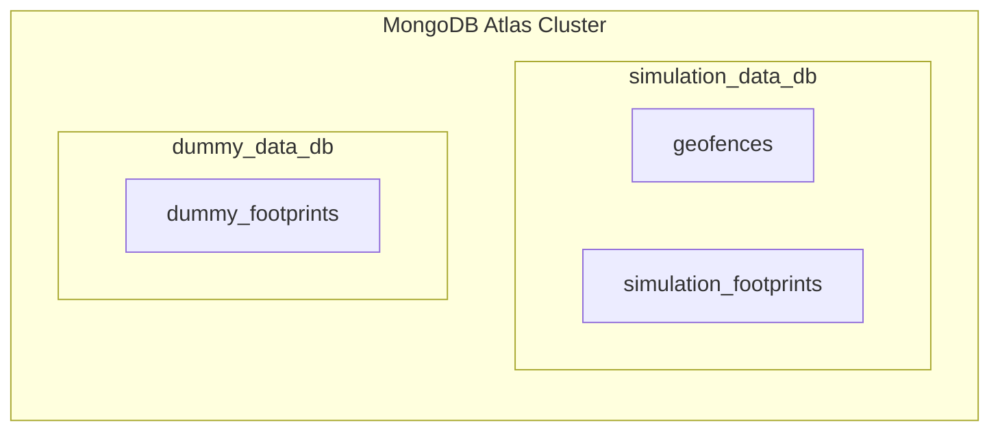

# Virtual Fence & Asset Tracking — User Manual

A comprehensive operational manual and technical guide for configuring, managing, and running real-time geofences, interactive boundary breach detection, live multi-asset simulations, and telemetry persistence with MongoDB.

---

## Table of Contents
1. [System Overview & Architecture](#1-system-overview--architecture)
2. [Prerequisites & Environment Setup](#2-prerequisites--environment-setup)
3. [User Interface Overview](#3-user-interface-overview)
4. [Creating & Editing Geofences](#4-creating--editing-geofences)
   - [Circular Geofences](#circular-geofences)
   - [Rectangular Geofences](#rectangular-geofences)
   - [Custom Polygon Geofences](#custom-polygon-geofences)
   - [Metadata, Colors & Status](#metadata-colors--status)
5. [Real-Time Mouse Tracking & Boundary Flags](#5-real-time-mouse-tracking--boundary-flags)
6. [Live Multi-Asset Simulation Engine](#6-live-multi-asset-simulation-engine)
   - [Assets & Kinetic Modeling](#assets--kinetic-modeling)
   - [Lifecycle: Entry, Interior Cruising, Exit & Re-Entry](#lifecycle-entry-interior-cruising-exit--re-entry)
   - [Simulation Controls](#simulation-controls)
7. [Flag & Footprint Display Controls](#7-flag--footprint-display-controls)
8. [MongoDB Atlas & Compass Database Guide](#8-mongodb-atlas--compass-database-guide)
   - [Database Roles: Simulation DB vs Dummy DB](#database-roles-simulation-db-vs-dummy-db)
   - [Document Schemas](#document-schemas)
   - [Inspecting Data in MongoDB Compass](#inspecting-data-in-mongodb-compass)
9. [Data Management & GeoJSON Integration](#9-data-management--geojson-integration)
10. [Troubleshooting & FAQ](#10-troubleshooting--faq)

---

## 1. System Overview & Architecture

Virtual Fence Map Builder is a high-performance web GIS and perimeter security application. It enables operators to draw virtual boundaries over multi-style base maps (Google Satellite, Hybrid, Streets, OpenStreetMap, Esri) and monitor continuous telemetry streams against those perimeters in real time.

```mermaid
graph TD
    UI[Browser Dashboard / Leaflet Canvas] -->|Draw / Edit Fences| Store[Client Geofence Store]
    UI -->|Mouse Telemetry & Flags| API[Python Flask REST API]
    UI -->|Simulation Engine (3s Loop)| Kinematics[Kinematic Vector Stepper]
    Kinematics -->|Perimeter Boundary Evaluation| Flags[Visual Flag Radar Pins & Toasts]
    Kinematics -->|POST /api/footprints| API
    API -->|Active Geofences & Live Telemetry| SimDB[(MongoDB: simulation_data_db)]
    API -->|On-Demand Synthetic Sequences| DummyDB[(MongoDB: dummy_data_db)]
    Compass[MongoDB Compass] -.->|Direct Cluster Inspection| SimDB
    Compass -.->|Direct Cluster Inspection| DummyDB
```

### Core Technologies
- **Frontend**: Leaflet.js, HTML5, Vanilla JavaScript, CSS3 with responsive glassmorphism aesthetic.
- **Containment Calculations**: Haversine Spherical Distance formula (Circles), Bounding Box intersection (Rectangles), Jordan Curve Ray-Casting algorithm (Polygons).
- **Backend**: Python 3 (Flask or Python standard HTTP engine).
- **Database**: MongoDB Atlas Cluster (split across `simulation_data_db` and `dummy_data_db`).

---

## 2. Prerequisites & Environment Setup

### System Requirements
- Python 3.8 or higher installed on your system.
- An internet connection for map tile loading and MongoDB Atlas cloud synchronization.
- A free or paid MongoDB Atlas cluster (or local MongoDB Community Edition).

### Step 1: Install Python Dependencies
Open your terminal in the project directory and run:
```bash
pip install -r requirements.txt
```

### Step 2: Configure MongoDB Connection
Create a `.env` file in the project root directory (refer to `.env.example`):
```env
# MongoDB Atlas Connection URI
MONGODB_URI=mongodb+srv://<username>:<password>@<cluster-url>.mongodb.net/?retryWrites=true&w=majority

# Primary Databases
MONGODB_SIMULATION_DB=simulation_data_db
MONGODB_DUMMY_DB=dummy_data_db

# Web Server Port
PORT=5000
```

> [!CAUTION]
> Never commit your real `.env` file to version control. The `.gitignore` file is pre-configured to keep your credentials strictly local and private.

### Step 3: Start the Backend Server
Launch the server via PowerShell, Command Prompt, or Bash:
```bash
python server.py
```

The terminal will confirm the connection to MongoDB Atlas:
```
================================================================
>> GEOFENCE MAP BUILDER - PYTHON BACKEND
>> Exclusive Database Engine: MongoDB Atlas & Compass
>> 1. Simulation DB (Live data, mouse, fences): 'simulation_data_db'
>> 2. Dummy Data DB (Area ENTER/INSIDE/EXIT):   'dummy_data_db'
>> Serving Dashboard at: http://localhost:5000
================================================================
```

### Step 4: Open the Dashboard
Navigate to `http://localhost:5000` in Google Chrome, Microsoft Edge, Firefox, or Safari.

---

## 3. User Interface Overview

```
+-----------------------------------------------------------------------------------------+
| [Search Location]                [MongoDB Compass Status] [Basemap Select] [Fit All]    |
+----------------------+------------------------------------------------------------------+
| [+ Add Geofence]     | [HUD: Cursor Lat/Lng | Mouse Fence | Flag Count | Center | Zoom] |
|                      |                                                                  |
| Shape Selector:      |                                                                  |
| (Circle / Rect / Poly)|                                                                  |
|                      |                                                                  |
| Geometry Inputs      |                               MAP CANVAS                         |
| (Radius / Bounds)    |                                                                  |
|                      |                      (Leaflet Interactive GIS)                   |
| Metadata & Color     |                                                                  |
| [Save Geofence]      |                                                                  |
|                      |                                                                  |
| Saved Fences List    |                                                                  |
|                      |                                                                  |
| Footprints & Sim:    |                                                                  |
| [▶ Start Simulation] |                                                                  |
| [👣 Drop 5 in Area]  |                                                                  |
| Event Log Stream     +------------------------------------------------------------------+
|                      | GEOFENCE DETAILS DOCK (Coordinates, Area, Perimeter, Copy, Edit) |
+----------------------+------------------------------------------------------------------+
```

1. **Top Header Bar**:
   - **Search Location**: Nominatim OpenStreetMap geocoding box. Type any city, facility, or landmark and press Enter to fly to that coordinate.
   - **Database Status Badge**: Displays real-time connectivity status with MongoDB Atlas.
   - **Basemap Switcher**: Instantly switch between 8 GIS layer styles:
     - Google Maps (Standard Streets, Satellite & Labels Hybrid, Terrain)
     - OpenStreetMap (Standard, Humanitarian)
     - Esri World (Street Map, World Satellite)
     - OpenTopoMap
   - **Fit All**: Adjusts map bounds so all saved geofences are visible in the viewport.
   - **Locate Me**: Jump immediately to your device's browser GPS coordinate.

2. **Left Control Sidebar**:
   - **Mode Selector**: Choose between Add Geofence and Explore Mode.
   - **Geofence Form**: Configure coordinates, radii, bounding boxes, polygon vertices, color, and name.
   - **Saved Geofences List**: Filter, select, edit, zoom to, or delete fences.
   - **GeoJSON Tools**: One-click export and import of GeoJSON files.
   - **Simulation & Switches**: Toggle mouse tracking, footprints, and visual flags; start/pause multi-asset simulation.
   - **Real-Time Event Stream**: Live chronological feed of `ENTER`, `INSIDE`, and `EXIT` events.

3. **Center Map Viewport**:
   - High-resolution interactive GIS canvas with draggable boundary nodes, animated radar flag markers, continuous asset avatars, and breadcrumbs.
   - **Floating HUD Bar**: Real-time cursor coordinates, active mouse fence status, total flags generated, map center, and zoom level.

4. **Bottom Details Dock**:
   - Displays exact mathematical calculations (Area in $m^2$/hectares, Perimeter in meters, exact coordinates) for the selected fence.
   - Quick **Copy Data** button to paste geofence coordinates into external tools.

---

## 4. Creating & Editing Geofences

### Circular Geofences
1. Click **+ Add Geofence** at the top of the sidebar.
2. Select the **Circle** mode tab.
3. Click anywhere on the map to place the center point.
4. Adjust the radius using any of the three synchronized methods:
   - **Map Drag**: Click and drag the white radius handle on the map perimeter.
   - **Radius Input / Slider**: Drag the slider from 20m to 2500m or enter an exact number in meters.
   - **Preset Buttons**: Click **50m**, **100m**, **200m**, **500m**, **1 km**, or **2 km**.

### Rectangular Geofences
1. Select the **Rectangle** mode tab.
2. Click and drag across any area on the map to define the bounding box.
3. Or manually enter the North, South, East, and West decimal coordinates into the bounding inputs.

### Custom Polygon Geofences
1. Select the **Polygon** mode tab.
2. Click consecutive points on the map to outline the perimeter (a dynamic line connects the vertices).
3. The vertex counter displays the total number of points added.
4. Click **✓ Finish Polygon** to close the boundary loop.
5. If you make a mistake, click **Clear Points** to start over.

### Metadata, Colors & Status
- **Geofence Name**: Enter an identifier (e.g. `Song River Sector Alpha`, `HQ Security Zone`). If left blank, an incremental name (e.g. `Geofence 1`, `Geofence 2`) is automatically assigned.
- **Description / Notes**: Optional field for security protocols or operational notes.
- **Zone Color**: Pick from 5 curated colors (Blue `#2563eb`, Green `#10b981`, Purple `#8b5cf6`, Amber `#f59e0b`, Red `#ef4444`). The perimeter line, fill tint, and telemetry flags will match this color.
- **Initial Status**: Toggle **Active** (monitored for breaches) or **Disabled** (ignored by tracking engines).
- Click **Save Geofence**. The geofence is immediately saved locally and synchronized with MongoDB `simulation_data_db.geofences`.

---

## 5. Real-Time Mouse Tracking & Boundary Flags

The system features real-time cursor boundary analysis that turns your mouse pointer into a virtual tracking asset.

### How It Works
1. As you move the mouse across the map canvas, the application checks whether the cursor coordinates reside inside any active geofence using:
   - Haversine distance for circles ($d \le R$).
   - Latitude/longitude span checks for rectangles.
   - Ray-casting point-in-polygon algorithm for complex polygons.
2. When the cursor crosses a fence perimeter:
   - **Entering Fence**: Triggers an `ENTER` transition.
     - A green radar flag marker (`🚩 ENTER: Mouse - <FenceName>`) is planted at the exact perimeter crossing coordinate.
     - A green toast alert appears: `🚩 Flag Generated: Mouse ENTERED "<FenceName>"`.
     - The floating HUD chip updates to `🟢 Inside "<FenceName>"`.
     - The event is logged in the sidebar stream and saved to MongoDB.
   - **Exiting Fence**: Triggers an `EXIT` transition.
     - A red radar flag marker (`🚩 EXIT: Mouse - <FenceName>`) is planted at the exit coordinate.
     - A warning toast alert appears: `🚩 Flag Generated: Mouse EXITED "<FenceName>"`.
     - The HUD updates to `Outside Fences`.

---

## 6. Live Multi-Asset Simulation Engine

The live asset simulation loop allows testing automated security patrols without physical GPS devices.

```
       [Drone Alpha] (North Edge)
             │
             ▼ (Heading South)
      ┌───────────────┐
      │  🚩 ENTER     │
      │               │
[Scout 9] ──►         │         ◄── [Patrol 101]
(West)   🚩 ENTER     │             (South-East)
      │               │
      │      🚩 EXIT  │
      └───────┬───────┘
              │ (Turns around after 2 steps outside)
              ▼
```

### Assets & Kinetic Modeling
The simulation runs three distinct operational assets:
1. **Drone Alpha** (Green Avatar): Approaches from the **North** edge (`-90°`), patrolling at 18 m/step.
2. **Patrol 101** (Blue Avatar): Approaches from the **South-East** edge (`+30°`), patrolling at 21 m/step.
3. **Scout 9** (Orange Avatar): Approaches from the **West** edge (`+150°`), patrolling at 24 m/step.

### Lifecycle: Entry, Interior Cruising, Exit & Re-Entry
- **Stage 1 (Staged Entry)**: Assets begin strictly outside the fence boundary facing the center. On the first step, all three assets cross the perimeter from their respective sides:
  - 🚩 Green flags are planted:
    - `ENTER: Drone Alpha - <FenceName>`
    - `ENTER: Patrol 101 - <FenceName>`
    - `ENTER: Scout 9 - <FenceName>`
  - Three success toasts notify the operator of perimeter entries.
- **Stage 2 (Interior Patrol)**: Assets cruise smoothly across the fence interior, leaving blue breadcrumb footprint dots every 3 seconds.
- **Stage 3 (Boundary Exit)**: Upon reaching the opposite side of the fence, the assets breach the perimeter outward:
  - 🚩 Red flags are planted: `EXIT: <Asset> - <FenceName>`.
  - Warning toasts alert of boundary exits.
- **Stage 4 (Kinematic Re-Entry)**: After taking 2 steps outside (~25–40m), assets execute a smooth U-turn heading back toward the fence center, re-entering the fence and planting new green `ENTER` flags.

> [!NOTE]
> The simulation refresh rate is set to 3 seconds (`3000ms`), providing clear visual feedback and realistic ground speeds.

### Simulation Controls
- **▶ Start Simulation**: Initiates the 3-second simulation loop. If assets were stopped, they re-stage cleanly outside the currently active/selected fence.
- **⏸ Pause Simulation**: Halts asset movements in place.
- **Automatic Fence Target Switching**: If you create a new geofence (e.g. `Geofence 2`) or select a different fence from the list, the assets automatically re-stage around the new fence and enter it.

---

## 7. Flag & Footprint Display Controls

Located under the **Footprints & Mouse Flags** section in the sidebar:

| Control Toggle | When ON (Checked) | When OFF (Unchecked) |
|---|---|---|
| **Mouse Cross Flag** | Detects mouse cursor crossing into/out of active fences. | Disables mouse boundary evaluation. |
| **Show Footprints** | Displays breadcrumb trail rings (`👣`) on the map canvas. | Hides breadcrumbs from map (data still logged). |
| **Show Flags** | Renders visual radar pins (`🚩 ENTER` / `🚩 EXIT`) on the map canvas. | **Suppresses map flag pins** for a clean map view, while still providing toast messages, HUD counter increments, and database logging. |

---

## 8. MongoDB Atlas & Compass Database Guide

### Database Roles: Simulation DB vs Dummy DB

The system cleanly separates telemetry data into two distinct databases in your MongoDB Atlas cluster:



1. **`simulation_data_db`**:
   - **`geofences`**: Stores all saved boundary perimeters, coordinates, radii, and statuses.
   - **`simulation_footprints`**: Contains real-time telemetry from live mouse navigation, map clicks, and the live 3-second multi-asset simulation loop.
2. **`dummy_data_db`**:
   - **`dummy_footprints`**: Contains on-demand synthetic test sequences generated via the **Drop 5 in Area** button or `POST /api/simulation/generate`.

### Document Schemas

#### Geofence Record (`simulation_data_db.geofences`):
```json
{
  "id": "geo_1790610000000_a1b2c3",
  "name": "Geofence 2",
  "type": "circle",
  "coordinates": { "lat": 30.123456, "lng": 78.123456 },
  "radius": 320.0,
  "status": "active",
  "color": "#2563eb",
  "description": "Primary facility security zone",
  "created_at": "2026-09-29T08:00:00.000Z",
  "updated_at": "2026-09-29T08:00:00.000Z"
}
```

#### Simulation Telemetry Record (`simulation_data_db.simulation_footprints`):
```json
{
  "id": "fp_1790610005000_d4e5f6",
  "device_id": "Drone Alpha",
  "geofence_id": "geo_1790610000000_a1b2c3",
  "geofence_name": "Geofence 2",
  "latitude": 30.124500,
  "longitude": 78.123456,
  "event": "ENTER",
  "color": "#10b981",
  "source": "simulation_loop",
  "created_at": "2026-09-29T08:00:03.000Z"
}
```

### Inspecting Data in MongoDB Compass

1. Open **MongoDB Compass** on your desktop.
2. Paste your connection string from `.env`:
   ```
   mongodb+srv://<username>:<password>@<cluster-url>.mongodb.net/?retryWrites=true&w=majority
   ```
3. Click **Connect**.
4. Both databases (`simulation_data_db` and `dummy_data_db`) will appear in the left database navigation pane:
   - Click **`simulation_data_db` &rarr; `geofences`** to view all active and saved boundary configurations.
   - Click **`simulation_data_db` &rarr; `simulation_footprints`** to see incoming real-time telemetry from `Drone Alpha`, `Patrol 101`, `Scout 9`, and `MOUSE_POINTER`.
   - Click the circular Refresh (**⟳**) button in Compass at any time to see newly streamed events.

---

## 9. Data Management & GeoJSON Integration

### Exporting Geofences to GeoJSON
1. In the sidebar under **Saved Geofences**, click **Export GeoJSON**.
2. A `.geojson` file (formatted as an RFC 7946 `FeatureCollection`) will automatically download to your browser.
3. This file can be imported into QGIS, ArcGIS, Google Earth, or any GIS application.

### Importing Geofences from GeoJSON
1. Click **Import GeoJSON**.
2. Select any standard `.geojson` or `.json` file containing `Polygon`, `Point` (with radius property), or `MultiPolygon` geometries.
3. The dashboard parses the coordinates, verifies topology, renders the shapes on the map, and stores them in MongoDB.

### Sample Demo Fences
Click **🎯 Sample Fences** to instantly populate the map with three pre-configured demo zones:
- `Sample Perimeter Alpha` (Circle, 320m)
- `Demo Sector B Depot` (Rectangle)
- `Headquarters Security Zone` (Circle, 200m)

---

## 10. Troubleshooting & FAQ

### Q: Why are flag markers not appearing on the map canvas?
- Check the **Show Flags** switch in the sidebar. If this switch is toggled **OFF**, visual flag radar pins on the map canvas are intentionally hidden to keep the map clean, but toast alerts and database telemetry logging continue to function. Toggle **Show Flags** to **ON** to see map pins.

### Q: Why are Drone Alpha and Scout 9 not generating ENTER flags?
- Ensure the simulation is running (**Pause Simulation** button is visible).
- When you click **Start Simulation** or create/select a new fence, all assets automatically stage outside the perimeter and cross the boundary within the first step, triggering green `ENTER` flags for all three assets.

### Q: How do I clear all historical footprints and flag markers?
- In the sidebar under **Footprints & Mouse Flags**, click the **✕** button in the Real-Time Event Stream header, or click **Clear All** in the Saved Geofences section. This clears markers from the map and issues a `DELETE /api/footprints` request to clear MongoDB logs.

### Q: The map shows "Offline / In-Memory Mode" instead of MongoDB.
- Verify that your MongoDB Atlas cluster IP access list allows connections from your current IP address (in the Atlas web console, go to **Network Access &rarr; Add IP Address &rarr; Allow Access from Anywhere `0.0.0.0/0`** for testing).
- Ensure your `.env` contains the correct connection string.
